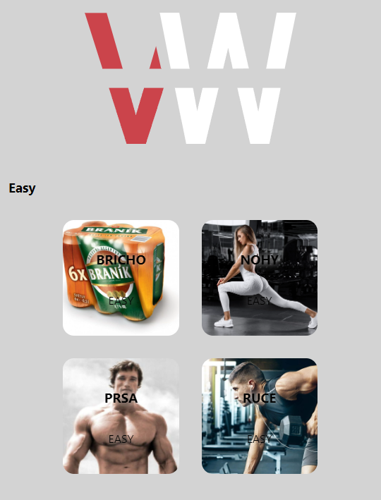
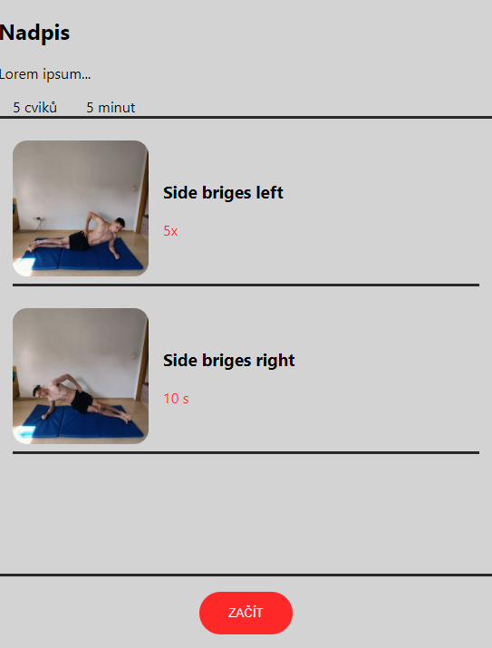
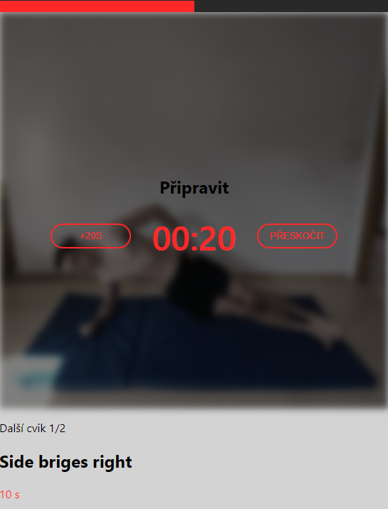
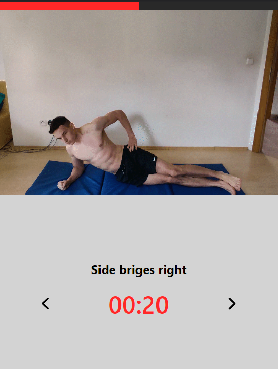
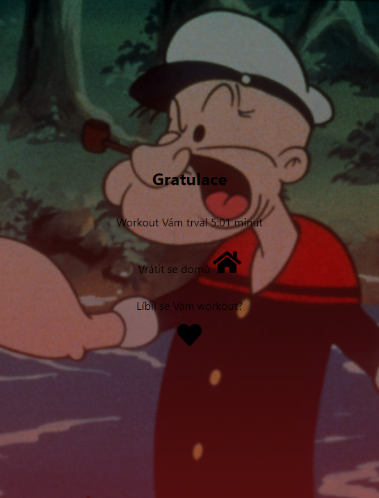

# Workout aplikace
- Mobilní aplikace na cvičení.
## Zpuštění aplikace
 - Ke zpuštění aplikace je potřeba nainstalovat nodejs, přejít do umístění aplikace, připojit npm balíčky pomocí ```npm install``` a zadat do příkazového řádku ``` npm run dev ```
## Funkce aplikace
 - Aplikace bude sloužit jako pomocník při každodenním cvičení, od úplných začátečníků, až po pokročilé.
 - Je zde možnost, vybrati si konkrétní partii na cvičení.
 - Tento výběr je obohacen možností volby obtížnosti.<br>
 
 ## Workout
 - Po přechodu na cvičící stránku vidíme tuto url ```http://localhost:3000/workout/{partie}/{obtížnost}```, partie jsou: <b>břicho, nohy, prsa a ruce</b> a obtížnost se dělí na <b>easy, medium a hard</b>.<br>
 ### Workout konkrétní

 - Uprostřed je list cviků, tak jak půjdou za sebou.
 - Nahoře je <b>název</b> a <b>popis</b> cviků. Ty se i s počtem a odhadlým cvičícím časem budou generovat samy.
 - Tlačítkem začít... začneme.<br>
### Workout pauza před cvikem

 - Nahoře je progress bar.
 - Uprostřed je odpočet času, s možností přeskočení a přidání času.
 - Dole je počet cviků, název cviku, a počet / čas opakování.
### Workout cvičení

 - Nahoře je stále progress bar.
 - Pod ním je ukázaný gif, který radí, jak cvik provést.
 - Dole je název cviku a ubíhající čas / počet.
 - Pak jsou zde tlačítka, na vrácení je k předchozímu cviku, a k pokračování k následujícímu.
 ### Workout konec
 
 - Zde je změřený čas cvičení, možnost ohodnotit workout srdíčkem (uloží se do paměti) a nebo se dá odejít zpět domů.

## Co je potřeba dodělat
- Po zvolení workoutu, buje aplikace schopna náhodně vygenerovat vlastní workout, tak aby odpovídal obtížnosti a zaměření. Jak počtem opakování, tak časem... Bude se odvíjet od  dat, které jsou v url ```const { id, difficulty } = useParams()```.
- Je potřeba zaimplementovat funkční countdown, který po dojetí přeskočí k dalšímu cviku.
- Pakliže při cvičící fázi, je nastaven čas, bude se zde ukazovat odpočet. Pokud je zde ale opakování, uživatel uvidí pouze číslo, které musí splnit.
- Všechny dynamické věci, které jsou teď v Reactu nahrazeny placeholdery budou nahrazeny realnými daty.
- React je napsán debilně úmyslně, né že bych ho používal poprvé, takže by to chtělo překopat strukturu, což bude celkem osina, sorry :/.
- Při psaní kódu doporučuji testovat aplikaci opravdovým cvičením. :)
- [Workout page](https://www.youtube.com/watch?v=dQw4w9WgXcQ)
